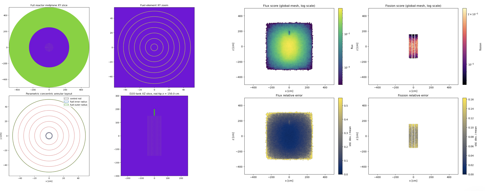
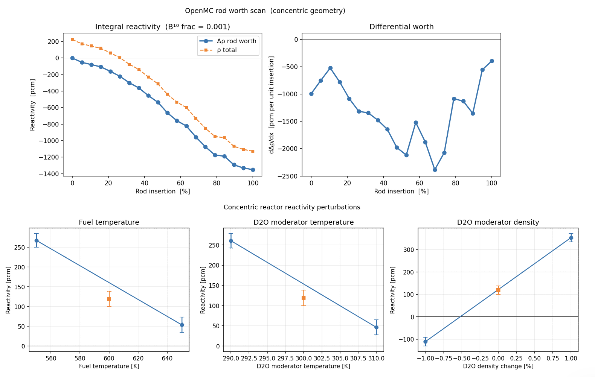
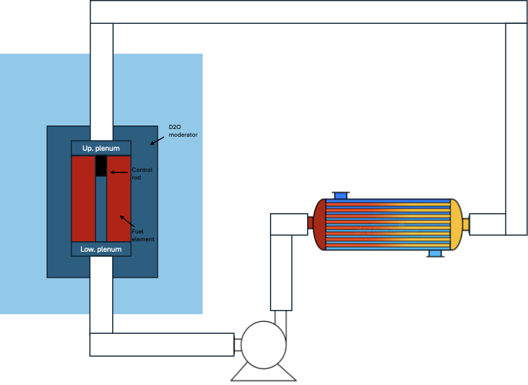
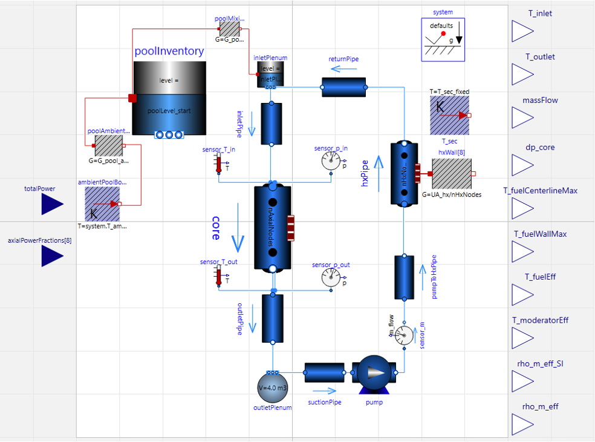

# Reactor Kinetics Lab

A web-based reactor simulator which runs a point-kinetics and diffusion-solver Python backend coupled to a Modelica-based thermal-hydraulics module.

The reactor is modeled with the OpenMC Monte Carlo transport code.

The current version models a simplified **heavy-water-moderated natural uranium fueled core** with one operator control: **control rod insertion**. The browser dashboard shows how **reactivity**, **total neutron flux**, **thermal power** and **coolant temperatures** evolve over time.


## Features

- lets you move a **single control rod bank** from fully withdrawn to fully inserted
- computes the resulting **reactivity**
- evolves the reactor with **point kinetics and delayed neutron groups**
- displays:
  - reactivity
  - total flux
  - thermal power
  - simulated time
  - neutron period estimate
  - core diffusion solution with flux and power maps
- supports:
  - pause / resume
  - reset to critical
  - manual SCRAM
  - automatic SCRAM on overpower

## Running locally

### Prerequisites

- [Bun](https://bun.sh/) 1.3+
- [uv](https://docs.astral.sh/uv/) for Python environment and dependency management

### Install frontend dependencies

```bash
bun run frontend:install
```

### Create the backend environment with UV

```bash
bun run backend:install
```

This runs `uv sync` inside `backend/`, creates the backend virtual environment, and installs the Python dependencies from `backend/pyproject.toml`.

### Start the hybrid dev stack

```bash
bun run dev
```

That launches the UV-managed Python backend and the Vite frontend on  `http://127.0.0.1:5173`.

> Quick backend check:
> `curl http://127.0.0.1:8000/api/health`


## Architecture

See [`docs/system_architecture.md`](docs/system_architecture.md).

## How the simulation works

## 1. Core model

See [`docs/reactor_model`](docs/reactor_model) for more details.

- First there was an initial homogeneous core: the simplified **annular core** in `docs/oneGroupHomogeneous.ipynb`. Its limitations motivated an OpenMC workflow, starting with an FRM-II-style involute core and ending with the concentric model in `openmc/concentric_reactor.ipynb`.



## 2. Reactivity model

The only operator input is **rod insertion percent**.

Rod position is converted into reactivity using a **rod-worth table** generated by `openmc/concentric_reactor_rodworth.py` and saved under `openmc/reference_data/concentric/rod_scan`. Backend interpolation is linear between table points.
- Total reactivity is computed as `ρ_total(x) = ρ_base(clean) + Δρ_rod(x) + ρ_scram + ρ_feedback`.

The dashboard shows reactivity in **pcm**, while the kinetics solver uses **delta-k/k** that come from a multi-group-cross-section generation in openmc using the `openmc.mgxs` library. More information is under the docs reactor_model.



## 3. Point-kinetics solver

The transient uses:

- **6 delayed neutron groups** and the neutron generation time aggregated from
  `openmc/reference_data/concentric/group_sweep/group_4/outputs/mgxs_constants.json`
- fuel, moderator-temperature, and moderator-density feedback from the OpenMC
  reactivity-coefficient CSV when the Modelica FMU supplies effective feedback
  values

The engine evolves:

- neutron population
- delayed neutron precursor concentrations

From that, it derives:

- thermal power from nominal power times neutron population
- total flux from the nominal display scale times neutron population

The integration step is **implicit**, which keeps the browser-driven local workflow stable for this stiff kinetics system.

For time stepping and history settings, see
[`backend/reactor_backend/config.py`](backend/reactor_backend/config.py) and the
[reactor-model documentation](docs/reactor_model/reactor_model_theory.pdf).

### Nominal scaling

Displayed values are scaled from nominal operating conditions:

- nominal thermal power: **20 MWth**
- nominal flux: **1.5 × 10¹² n/cm²/s** (still used for display scaling; inherited from the legacy Estimate 2 annular-core solution)

## 4. Thermal-hydraulics solver

The Python backend supplies total power and an eight-node axial power shape to
the Modelica FMU. The axial shape currently comes from the legacy one-group
diffusion helper. The FMU returns coolant conditions, effective fuel and
moderator temperatures, and moderator density for the HMI and reactivity
feedback. See [`docs/fmu_coupling.md`](docs/fmu_coupling.md).





## What is simplified

This is still an educational first slice. Intentional simplifications:

- one effective rod bank instead of a full control system
- no xenon, burnup, or two-phase void model
- rodded diffusion uses an equivalent absorber and the clean-core power-shape correction
- the FMU axial power shape still comes from the legacy one-group diffusion helper
- the displayed absolute flux still uses the legacy Estimate 2 normalization
- flux and power are scaled from nominal values

## Next steps

- make FMU export and distribution reproducible across Linux and macOS
- replace the legacy absolute-flux normalization with an OpenMC-derived value

## License

Software source code is licensed under the MIT License. See [LICENSE](LICENSE).

Unless otherwise noted, documentation and images in this repository are provided under the same license as the part of the project they accompany.
