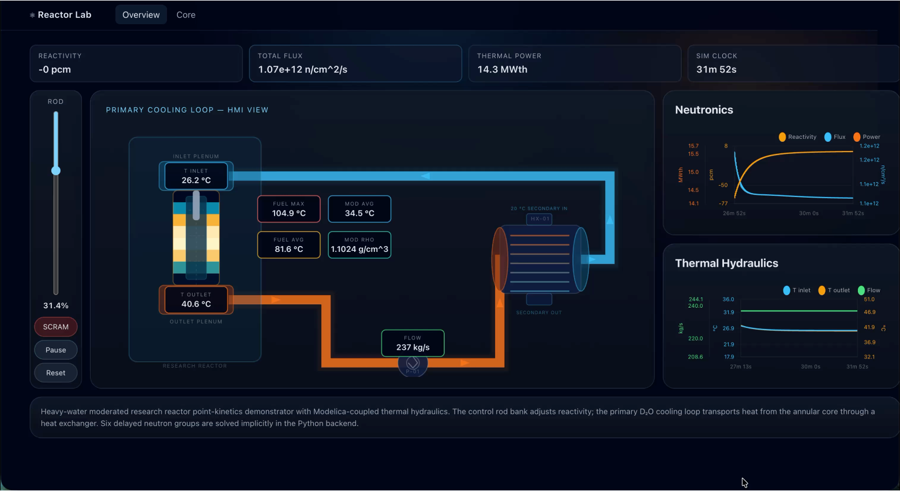

# Reactor Kinetics Lab

A web-based reactor simulator which runs a point kinetics and diffusion solver python backend coupled to a modelica based thermal-hydraulics module.

The reactor is modeled with montecarlo OpenMC software.

The current version models a simplified **heavy-water-moderated natural uranium fueled core** with one operator control: **control rod insertion**. The browser dashboard shows how **reactivity**, **total neutron flux**, **thermal power** and **coolant temperatures** evolve over time.



## Features

- lets you move a **single control rod bank** from fully withdrawn to fully inserted
- computes the resulting **reactivity**
- evolves the reactor with **point kinetics and delayed neutron groups**
- displays:
  - reactivity
  - total flux
  - thermal power
  - simulated time
  - neutron period estimate
  - core diffusion solution with flux and power maps
- supports:
  - pause / resume
  - reset to critical
  - manual SCRAM
  - automatic SCRAM on overpower

## Running locally

### Prerequisites

- [Bun](https://bun.sh/) 1.3+
- [uv](https://docs.astral.sh/uv/) for Python environment and dependency management

### Install frontend dependencies

```bash
bun run frontend:install
```

### Create the backend environment with UV

```bash
bun run backend:install
```

This runs `uv sync` inside `backend/`, creates the backend virtual environment, and installs the Python dependencies from `backend/pyproject.toml`.

### Start the hybrid dev stack

```bash
bun run dev
```

That launches:

- the UV-managed Python backend on `http://127.0.0.1:8000`
- the Vite frontend on `http://127.0.0.1:5173`

Open `http://127.0.0.1:5173`.

### Quick backend check

```bash
curl http://127.0.0.1:8000/api/health
```

## Architecture

See `docs/system_architecture.md`

## How the simulation works

## 1. Core model

See `docs/reactor_model` for more details.

- First there was an initial homogeneous core - the simplified **annular core** (Estimate 2 geometry from `theory/reactorModel.ipynb`); then an openmc `openmc` workflow where we first realize issues with the diffusion model and then generate better fidelity cores starting with a frm2 style involute core and ending with a concentric core `openmc/concentric_reactor.ipynb` like the MURR reactor.

## 2. Reactivity model

The only operator input is **rod insertion percent**. --> add flow rate in primary and secondary later!.

Rod position is converted into reactivity using a **rod-worth table** generated at `openmc/concentric_reactor_rodworth.py` and saved as reference data `openmc/reference_data/concentric/rod_scan` Backend interpolation is linear between table points.
- Total reactivity is computed as `ρ_total(x) = ρ_base(clean) + Δρ_rod(x) + ρ_scram + ρ_feedback`.

The dashboard shows reactivity in **pcm**, while the kinetics solver uses **delta-k/k** that come from a multi-group-cross-section generation in openmc using the `openmc.mgxs` library. More information is under the docs reactor_model.

- `beta_eff = 0.00678910882978 = 678.91 pcm`
-  `prompt_time = 0.004172s`

## 3. Point-kinetics solver

The transient uses:

- **6 delayed neutron groups** aggregated from
  `openmc/reference_data/concentric/group_sweep/group_4/outputs/mgxs_constants.json`
- neutron generation time: **0.00417212833712 s**, from the export's prompt
  generation-time tally
- fuel, moderator-temperature, and moderator-density feedback from the OpenMC
  reactivity-coefficient CSV when the Modelica FMU supplies effective feedback
  values

The engine evolves:

- neutron population
- delayed neutron precursor concentrations

From that, it derives:

- thermal power using diffusion solver and correction power map, see `openmc/diffusion_concentric_reactor.ipynb`
- total flux

The integration step is **implicit**, which keeps the browser-driven local workflow stable for this stiff kinetics system.

### Nominal scaling

Displayed values are scaled from nominal operating conditions:

- nominal thermal power: **20 MWth**
- nominal flux: **1.5 × 10¹² n/cm²/s** (Estimate 2 annular-core peak, 2D solution)

## 4. Time stepping and history

The backend advances the model using:

- integrator step: **0.02 s**
- history sampling: **0.25 s**
- chart history length: **240 points**
- simulation speed: **8x wall clock**
- frontend poll interval: **100 ms**

## What is simplified

This is still an educational first slice. Intentional simplifications:

- one effective rod bank instead of a full control system
- no thermal-hydraulic feedback
- no xenon, temperature coefficients, void coefficients, or burnup
- flux and power are scaled from nominal values

## Next steps

- FMU build handlded outside of python and frozen (not gitignored)? or handled by a script, like with bun run backend:install? this way simulator can run on macos (if doable)
- Cleaning up the documentation

## License

Software source code is licensed under the MIT License. See [LICENSE](/LICENSE).

Unless otherwise noted, documentation and images in this repository are provided under the same license as the part of the project they accompany.