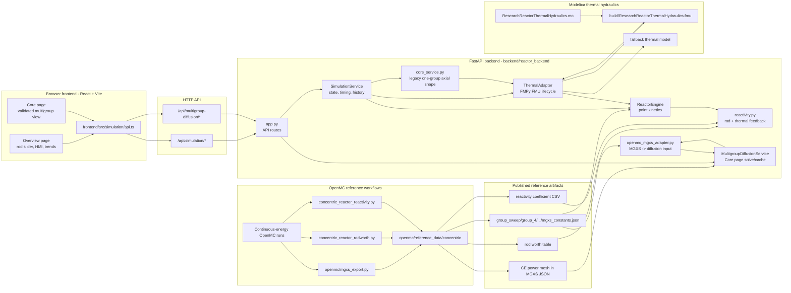

# Webapp System Architecture

This diagram shows the webapp runtime architecture and the offline reference
data paths that feed it.

## Runtime Data Flow

The Overview page uses `/api/simulation/*`.

1. The frontend sends rod, pause, reset, and SCRAM commands to FastAPI.
2. `SimulationService` owns simulation time, server-side history, and state.
3. `ReactorEngine` advances the point-kinetics equations.
4. `reactivity.py` combines OpenMC rod worth, SCRAM penalty, and thermal
   feedback.
5. `core_service.py` supplies the current rod-aware eight-node axial power
   fractions from the legacy one-group shape helper.
6. `ThermalAdapter` advances the Modelica FMU and returns a `ThermalSnapshot`.
7. The frontend polls `/api/simulation/state` and renders HMI values and trend
   charts from the returned snapshot and history.

The Core page uses `/api/multigroup-diffusion/*`.

1. `MultigroupDiffusionService` loads the published OpenMC MGXS export.
2. `openmc_mgxs_adapter.py` validates domain metadata and converts it into
   resolved diffusion input.
3. The backend solves the validated four-group diffusion problem.
4. The returned state includes mirrored x-z flux and power maps plus axial and
   radial profiles for the frontend Core page.

## OpenMC Reference Data Flow

OpenMC is not run by the webapp at request time. It is an offline reference-data
producer.

The currently used reference artifacts include:

- MGXS constants and prompt generation time from
  `openmc/reference_data/concentric/group_sweep/group_4/outputs/mgxs_constants.json`
- OpenMC-derived delayed neutron data loaded by `kinetics_reference.py`
- OpenMC CE rod worth loaded by `rod_worth.py`
- OpenMC reactivity coefficients loaded by `reactivity_coefficients.py`
- CE power-shape correction data used by the multigroup Core visualization

These artifacts are treated as immutable inputs during normal webapp operation.
The CE-corrected four-group power map is not yet the FMU axial heat-source
input; that remaining path still uses the legacy one-group shape helper.

## FMU Coupling Summary

The Modelica coupling is owned by `ThermalAdapter`.

The adapter:

- checks whether the existing FMU is fresh and exposes the required variables
- exports a new FMU with OpenModelica when needed
- instantiates the FMU with FMPy
- writes `totalPower` and `axialPowerFractions`
- steps the co-simulation slave
- reads inlet/outlet temperatures, effective fuel/moderator temperatures,
  moderator density, mass flow, and core pressure drop

If FMU export, initialization, or stepping fails, the adapter switches to a
fallback thermal model so the webapp remains controllable. Thermal reactivity
feedback is still FMI-only: fallback thermal values can populate the HMI, but
they do not change point-kinetics reactivity.

See `docs/fmu_coupling.md` for the detailed FMU lifecycle.

## API Boundary

The frontend treats the backend as the source of truth. The browser does not
advance physics locally.

Primary API groups:

- `/api/simulation/*` for the Overview page and point-kinetics transient
- `/api/multigroup-diffusion/*` for the Core page diffusion solve

Legacy backend routes for old one-group core/transient visualizations may still
exist internally, but they are not the frontend's canonical spatial neutronics
view.

## Frontend

The frontend is a **Bun-managed React + TypeScript** app.

Its job is to:

- render the dashboard
- send user commands to the backend
- poll the latest state from the backend
- display the rolling history charts and core schematic

Key frontend files:

- `frontend/src/App.tsx`
  - dashboard composition and control wiring
- `frontend/src/hooks/useReactorSimulation.ts`
  - API polling, command calls, and React state integration
- `frontend/src/simulation/api.ts`
  - frontend API client for the Python service
- `frontend/src/components/`
  - schematic, charts, and metric cards

Vite proxies `/api` requests to the Python backend during development.

## Backend

The backend is a small **FastAPI** service in `backend/reactor_backend/`.

Its job is to:

- own the reactor engine state
- advance the transient over elapsed wall time when the simulation is running
- keep rolling history on the server side
- expose the current snapshot and control endpoints to the frontend

Key backend files:

- `backend/reactor_backend/config.py`
  - reactor constants and simulation tuning
- `backend/reactor_backend/reactivity.py`
  - rod-worth to reactivity mapping
- `backend/reactor_backend/engine.py`
  - point-kinetics engine
- `backend/reactor_backend/service.py`
  - stateful simulation service, history, and timing
- `backend/reactor_backend/thermal_adapter.py`
  - Modelica FMU lifecycle, inputs/outputs, compatibility checks, and fallback
- `backend/reactor_backend/multigroup_service.py`
  - cached four-group clean-core diffusion service
- `backend/reactor_backend/multigroup_sph.py`
  - CE-referenced SPH fitting, application, and qualification
- `backend/reactor_backend/app.py`
  - FastAPI routes

The Modelica FMU coupling is documented in `docs/fmu_coupling.md`.
The webapp system architecture diagram is documented in
`docs/system_architecture.md`.

The frontend Core page is the validated OpenMC-informed multigroup view. It
uses the existing multigroup backend API, follows the
`openmc/diffusion_concentric_reactor.ipynb` four-group diffusion setup
(`groupwise_fvm`, 0.1/1/5/20 cm radial targets, 10 cm axial target), mirrors
the cylindrical field into an x-z image, and applies the clean OpenMC CE
power-shape correction only to the displayed fission power map. Runtime SPH
factors are not applied. Its export and
cache locations can be overridden with `MULTIGROUP_MGXS_EXPORT_DIR` and
`MULTIGROUP_DIFFUSION_CACHE_DIR`.
